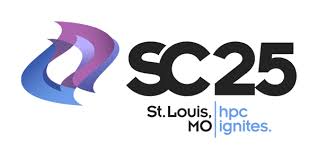

---
hide:
  - navigation
  - toc
---

# Home

## 7th International Workshop on Containers and New Orchestration Paradigms for Isolated Environments in HPC

HPC-Containers Slack channel: [Join Link](http://bit.ly/hpccslack)

CANOPIE HPC Workshop @ SC25
Monday, November 17th, 9AM–5:30PM (CST)

Held in conjunction with SC25: The International Conference for High Performance Computing, Networking, Storage, and Analysis.

{: style="width:318px; margin-right:159px"} 

### ABOUT

Containers and New Orchestration Paradigms for Isolated Environments in HPC
(CANOPIE-HPC) is a workshop focusing on containerization, virtualization, and
other methods to implement user-defined, bring-your-own, or isolated software
environments. The seventh workshop will be hosted at the 2025 International
Conference for High Performance Computing, Networking, Storage and Analysis
(SC25). The objective of this workshop is to serve as the principal venue for
leaders in the field to stimulate research and interactions in relation to
cutting-edge container technologies, virtualization, and OS system software as
it relates to supporting High Performance Computing (HPC).

### Proceedings

[Proceedings from CANOPIE-HPC 2024](https://conferences.computer.org/sc-wpub/#!/toc/0#CANOPIE-HPC2024:6thInternationalWorkshoponContainersandNewOrchestrationParadigmsforIsolatedEnvironmentsinHPC)

[Proceedings from CANOPIE-HPC 2023](https://dl.acm.org/doi/proceedings/10.1145/3624062?tocHeading=heading4#heading4)

[Proceedings from CANOPIE-HPC 2019-2022](https://ieeexplore.ieee.org/xpl/conhome/1835005/all-proceedings)
